## BIOL8701: Dividing and conquering sequence alignment using braided De Bruijn Graphs
<!-- paginate: skip -->
<!-- _class: coverpage -->

- Student: Richard Morris
- Huttley lab, Australian National University
- Supervisors: Gavin Huttley 

# Where does alignment fit in genomics?
<!-- paginate: true -->
<!-- paginate: hold -->

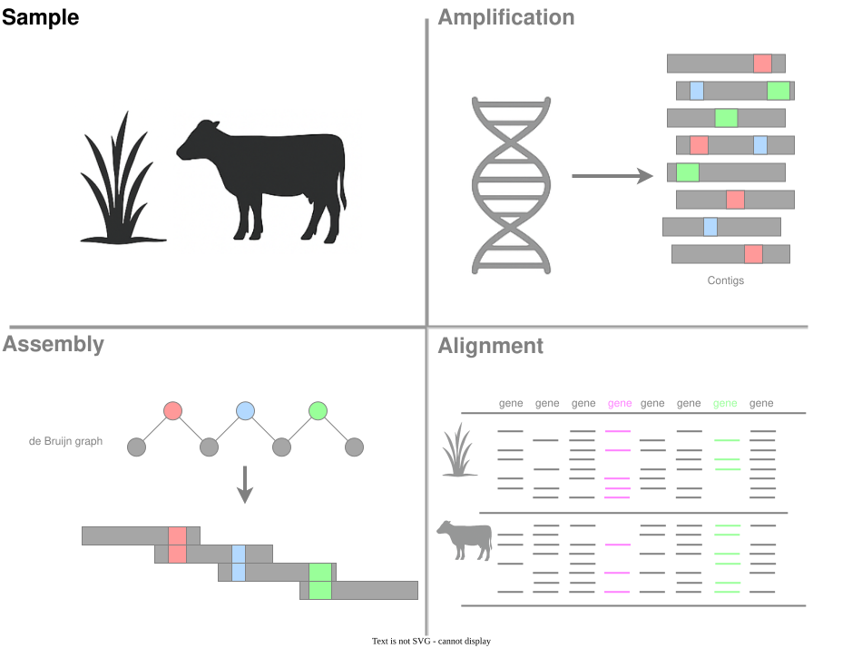
<!-- _footer: "Original artwork motivated by chatGPT 4o"-->

# Where does alignment fit in genomics?
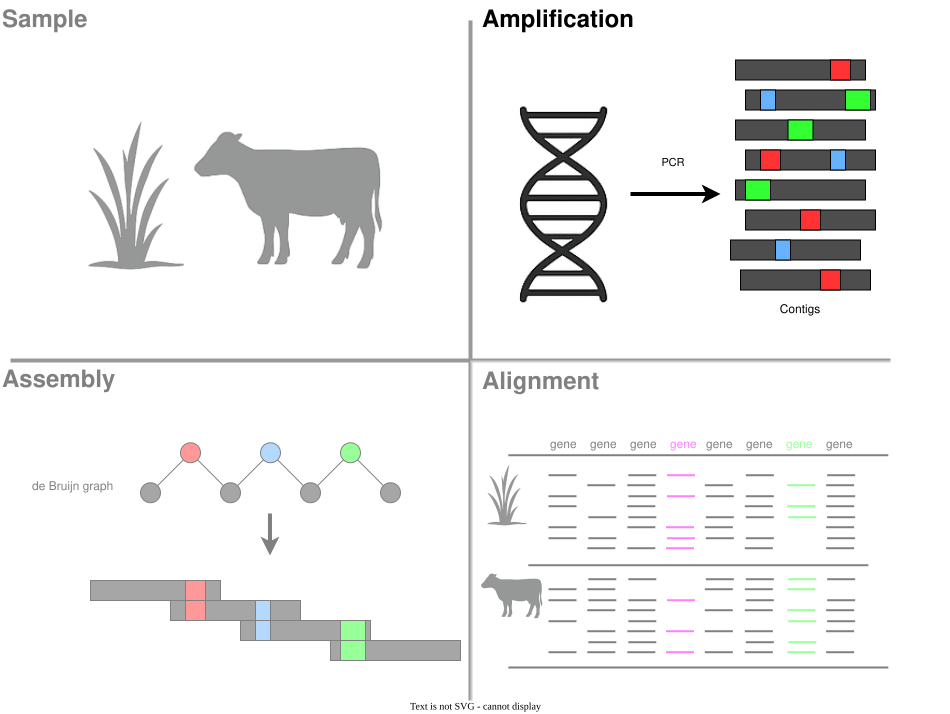

<!-- _footer: "Original artwork motivated by chatGPT 4o"-->

# Where does alignment fit in genomics?
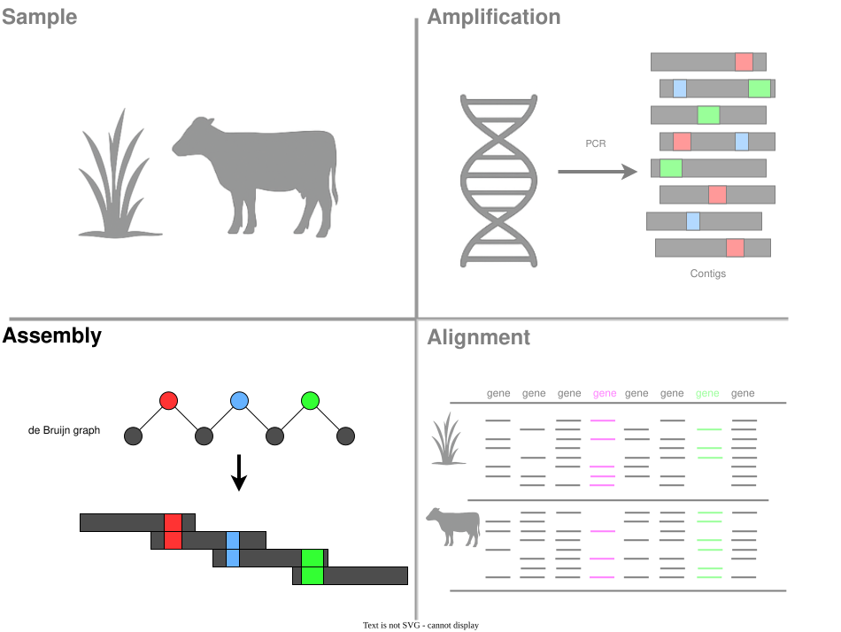

<!-- _footer: "Original artwork motivated by chatGPT 4o"-->

# Where does alignment fit in genomics?
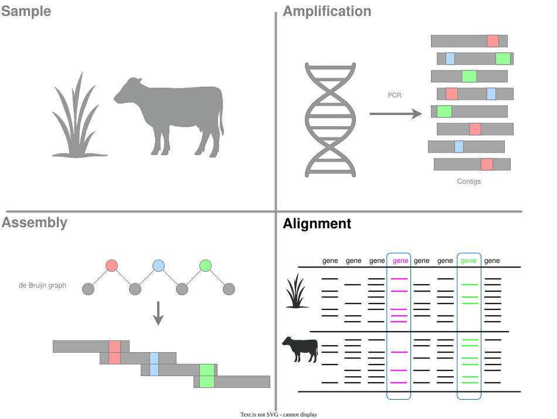

<!-- _footer: "Original artwork motivated by chatGPT 4o"-->
# Algorithm: Needleman-Wunsch$_3$ pairwise alignment
<!-- paginate: true -->

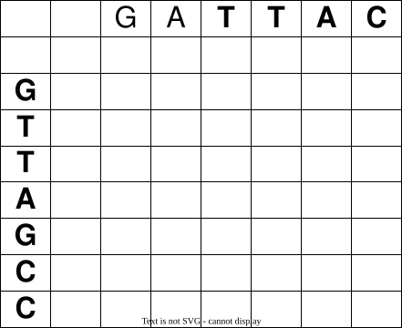
<!-- _footer: "3[Needleman & Wunsch, 1970  doi.org/10.1016/0022-2836(70)90057-4](https://doi.org/10.1016/0022-2836(70)90057-4)" -->

# Algorithm: Needleman-Wunsch$_3$ pairwise alignment
<!-- paginate: hold -->

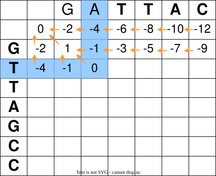
<!-- _footer: "3[Needleman & Wunsch, 1970  doi.org/10.1016/0022-2836(70)90057-4](https://doi.org/10.1016/0022-2836(70)90057-4)" -->

# Algorithm: Needleman-Wunsch$_3$ pairwise alignment
<!-- paginate: hold -->

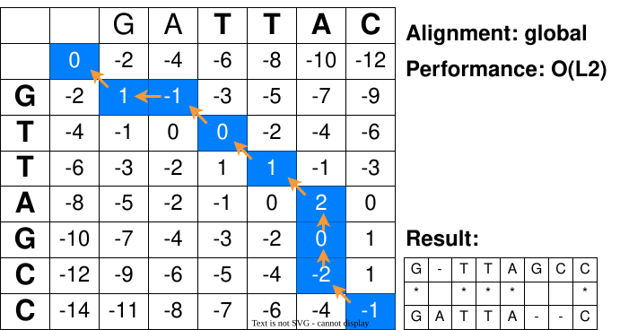
<!-- _footer: "3[Needleman & Wunsch, 1970  doi.org/10.1016/0022-2836(70)90057-4](https://doi.org/10.1016/0022-2836(70)90057-4)" -->

# Algorithm: Smith Waterman$_5$ local alignment
<!-- paginate: true -->

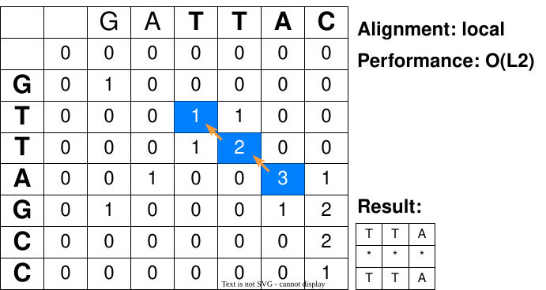

<!-- _footer: "4[Smith & Waterman, 1981  10.1016/0022-2836(81)90087-5](https://doi.org/10.1016/0022-2836(81)90087-5)" -->

# Multiple sequence alignment
"Multiple sequence alignment is just pairwise alignment, repeated many times".
 
 

Complexity order: $O((n-1).L^2)$ 
  - $L$ = length of sequence
  - $n$ = number of sequences

# Algorithm: de Bruijn$_1$ graphs
<!-- paginate: true -->

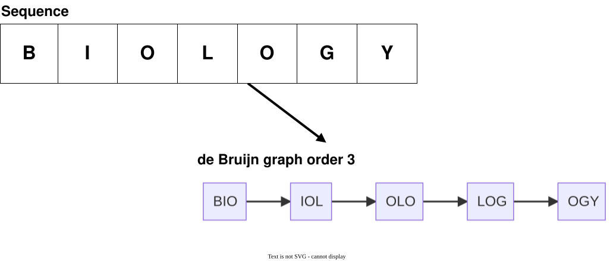
<!-- _footer: "1 de Bruijn (1946) -->

# Algorithm: de Bruijn graphs
<!-- paginate: hold -->

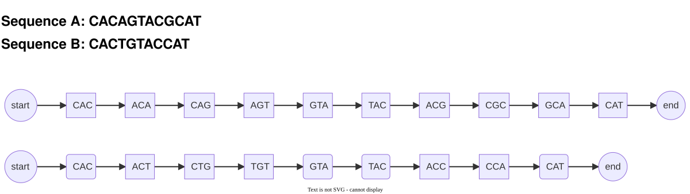

# Algorithm: de Bruijn graphs
<!-- _paginate: hold -->

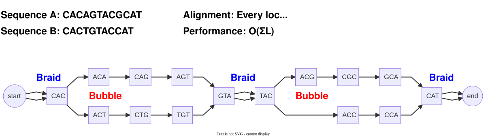

# Algorithm: de Bruijn graphs
<!-- _paginate: hold -->

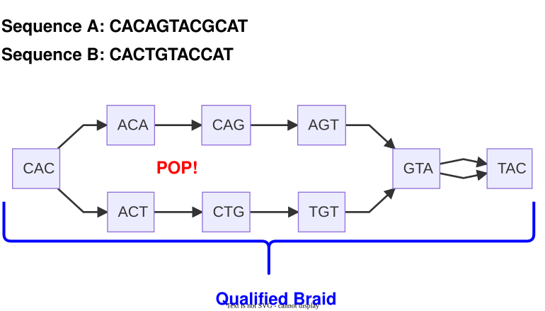
<!-- _footer: "2[Karlin & Altschul, 1990  doi.org/10.1073/pnas.87.6.2264](https://doi.org/10.1073/pnas.87.6.2264)" -->

# Algorithm: Karlin Altschul$_2$ test
<!-- _paginate: true -->

The Karlin–Altschul test is a statistical framework used to assess the significance of high-scoring segment pairs (HSPs) in local sequence alignments, particularly in tools like BLAST.

It models the distribution of maximum alignment scores between two random sequences as following a Gumbel (extreme value) distribution

$$E = K.m.n.e^{-\lambda S}$$
- $E$: expected number of alignments with score $\geq$ S
- $K$: scale (depends on scoring scheme)
- $\lambda$: decay (depends on scoring scheme)
- S: alignment score
- m: length of sequence 1
- n: length of sequence 2

<!-- _footer: "2[Karlin & Altschul, 1990  doi.org/10.1073/pnas.87.6.2264](https://doi.org/10.1073/pnas.87.6.2264)" -->

# Algorithm: Karlin Altschul$_2$ test **for biologists**
<!-- _paginate: hold -->

If a potential local alignment, containing substitutions, meets a threshold (p-value) for equality.

 

ie: are `CAC|A|GTAC` and `CAC|T|GTAC`, below, significantly (p=0.05) the same sequence?

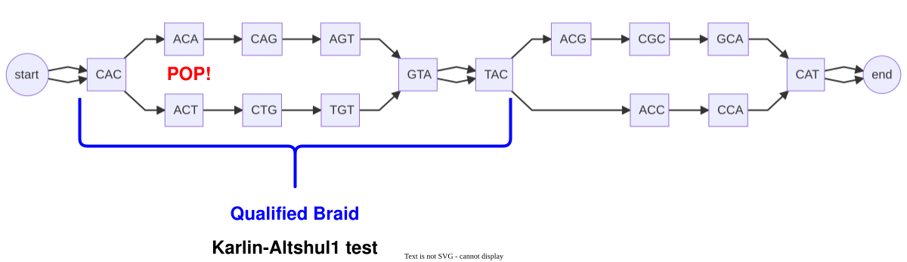

<!-- _footer: "2[Karlin & Altschul, 1990  doi.org/10.1073/pnas.87.6.2264](https://doi.org/10.1073/pnas.87.6.2264)" -->

# Experimental data

- Mammal genomes obtained from **Ensembl**: release 113 (current release)
- **Queried**: using `ensembl-tui` (Text User-Interface) application
- **Extracted**: 1597 one-to-one orthologs to human chromosome 1 protein coding genes 
- **Aligned**: using cogent3 (pair-HMM) and MADB (de Bruijn graph) algorithms

# Hypothesis 1
<!-- paginate: true -->

 

The longest braid in a pair of sequences will correspond to the ungapped Smith-Waterman local alignment.* 

 

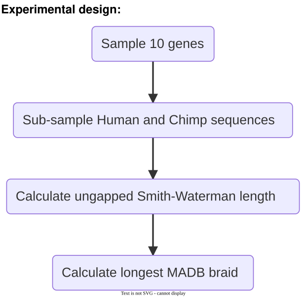

<!-- _footer: "* a gap not required within $k$ characters of the start of a bubble

or a cycle that has been stashed in just one sequence path"-->

# Background for Hypothesis 1

*A braid has no gaps, this corresponds to a local alignment*

 

- The Smith-Waterman algorithm is an optimal solution for finding the highest scoring local alignment
- the longest braid in a de Bruijn graph should equal the Smith-Waterman alignment

# Results - longest braid vs ungapped Smith-Waterman

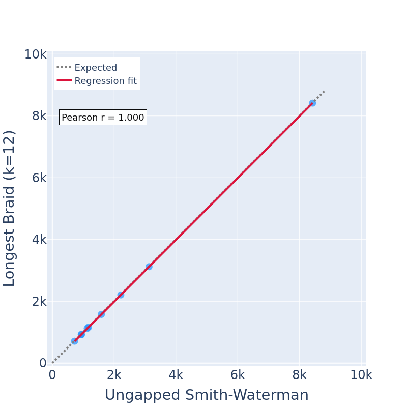

# Summary for hypothesis 1

### Smith-Waterman 

produces **just one** best local alignment in quadratic time $O(L^2)$

### de Bruijin graph 

produces **every** local alignment in linear time $O(\Sigma L)$

# Summary for hypothesis 1
<!-- paginate: hold -->

### Smith-Waterman 

produces **just one** best local alignment in quadratic time $O(L^2)$

### Bruijin graph 

produces **every** local alignment in linear time $O(\Sigma L)$

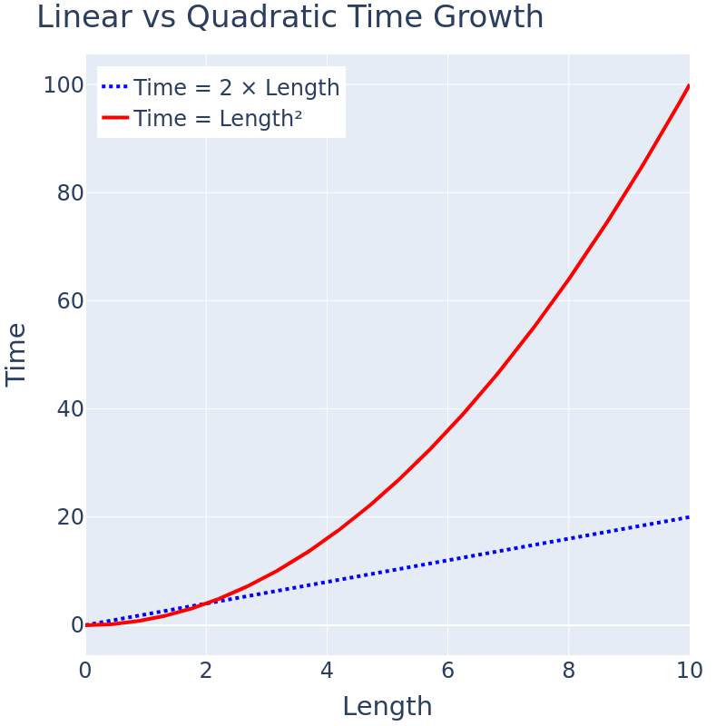

# Hypothesis 2
<!-- paginate: true -->

Differences in braids, will be a better approximation to the true *genetic distance* than *Jaccard*.

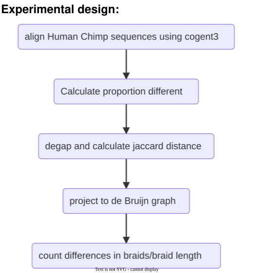

# Background for Hypothesis 2

- Genetic distance is the time since two species diverged from a common ancestor
- Influences the likelihood that 2 sequences containing substitutions are the same
- Required to construct reliable scoring functions for alignment methods

# Term: *Genetic distance*

### Consider the proportionate difference (PD) between 2 *aligned* sequences.

$$PD=\frac{substitutions}{positions}$$

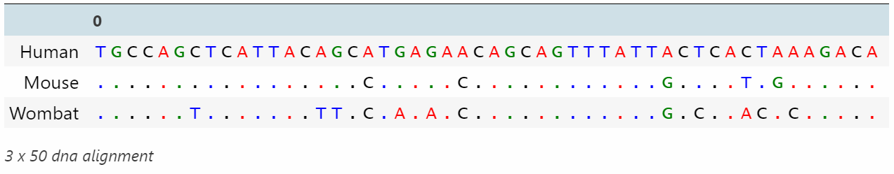

$$PD_{human,mouse}=\frac{5}{50} = 0.1$$
$$PD_{human,wombat}=\frac{13}{50} = 0.26$$

# Term: *Jaccard distance*
<!-- paginate: true -->

- **Jaccard** distance is a measure of dissimilarity between two sets, defined as the size of the intersection divided by the size of the union of the sets.

$Jaccard = \frac{I}{U}$ 

- Jaccard can be calculated for *unaligned* sequences, by decomposing them into $k$-mers and comparing the ratio of common $k$-mers to total $k$-mers
- it is used to infer genetic distance for many modern alignment methods.

# Result 2 Jaccard distance vs PD

 
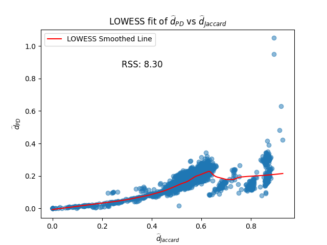

# Term: *Stone metric (SM)*

Under the assumption that the expected number of substitutions that have occurred in seqeuences since the last common ancestor are evenly distributed across the sequences, the PD of all local alignments of the sequences will approach the PD of fully aligned sequences. 

$SM =  \frac{sum\ of\ Braid\ differences}{sum\ of\ Braid\ lengths}$ 

# Result 2 Stone braid metric

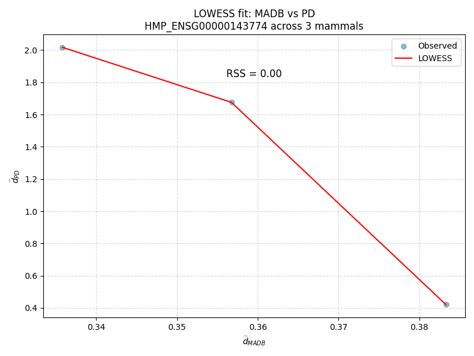

# Summary for hypothesis 2 

- Jaccard distance is a poor approximation of PD as it is noisy, and mapping functions of one to the other are context dependent on the species being aligned 
- Stone metric is a better approximation of PD as it constrains the search space to all local alignments of the sequences

# Hypothesis 3
<!-- paginate: hold -->

We predict that the de Brujin graph aligner will perform (statistically and computationally) better with less diverged sequences.

 

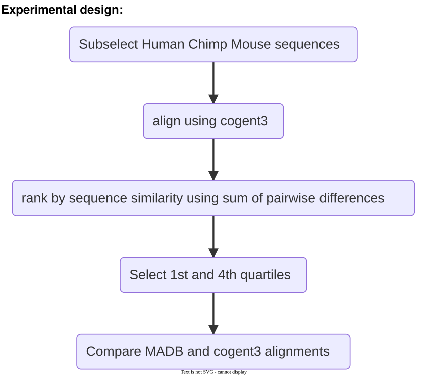

# Background for Hypothesis 3

⬆genetic distance ⇒ ⬆bubbles ⇒ ⬇braids ⇒ ⬆work 

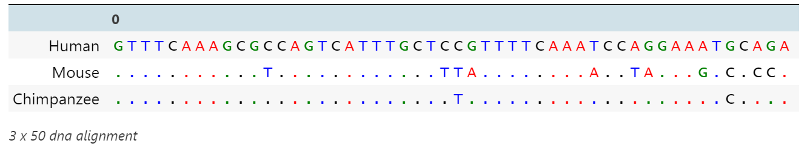

# Result

### MADB accuracy and performance by divergence

###### Human to Chimpanzee orthologous gene alignment
| quartile | mean alignment score (%) | mean performance (s) |
|---|---|---|
| 1st|TBD|TBD|
| 4th|TBD|TBD|

###### Human to Mouse orthologous gene alignment
| quartile | mean alignment score (%) | mean performance (s) |
|---|---|---|
| 1st|TBD|TBD|
| 4th|TBD|TBD|
|---|---|---|

| mean sum of pairwise differences | mean performance (s) | mean memory (MB) |
|---|---|---|
| TBD | TBD | TBD |
| TBD | TBD | TBD |

||diverged|close|
|---|---|---|
|human-chimpanzee|TBD|TBD|TBD|
|human-mouse|TBD|TBD|TBD|

# Summary for hypothesis 3

- braids can be resolved in linear time $O(\Sigma L)$
- bubbles require a quadratic time complexity $O(L^2)$ to resolve
- more divergent sequences will have a higher ratio of positions in bubbles to those in braids, and therefore a higher time complexity

# Hypothesis 4
<!-- paginate: hold -->

 

de Bruijn graph alignment will be more computationally efficient than Needleman-Wunsch.

 

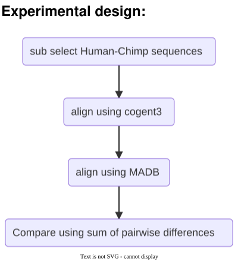

# Result 

###### Human to Chimpanzee orthologous gene alignment

# Summary for hypothesis 4

- de Bruijn graph alignment is more computationally efficient than Needleman-Wunsch because it only requires costly computation 

# Thanks

- Gavin Huttley
- Yu Lin
- Xinjian Leng

## ... and the Huttleylab

# Questions & Answers

# Citations
<!-- paginate: False -->
1. de Bruijn(1946) 'A Combinatorial Problem.' Koninklijke Nederlandse Akademie van Wetenschappen, Proceedings 49 (1946): 758–64.
2. [Karlin & Altschul(1990), 'Methods for assessing the statistical significance of molecular sequence features by using general scoring schemes'  doi.org/10.1073/pnas.87.6.2264](https://doi.org/10.1073/pnas.87.6.2264)
3. [Needleman & Wunsch(1970), 'A general method applicable to the search for similarities in the amino acid sequence of two proteins'  doi.org/10.1016/0022-2836(70)90057-4, 2010](https://doi.org/10.1016/0022-2836(70)90057-4)
4. [Pevzner, Haixu & Waterman(2001), 'An Eulerian Path Approach to DNA Fragment Assembly.' doi.org/10.1073/pnas.171285098 ](https://doi.org/10.1073/pnas.171285098)
5. [Smith & Waterman(1981), 'Identification of Common Molecular Subsequences.'  doi.org/10.1016/0022-2836(81)90087-5](https://doi.org/10.1016/0022-2836(81)90087-5)

# Addendum - Removing cycles

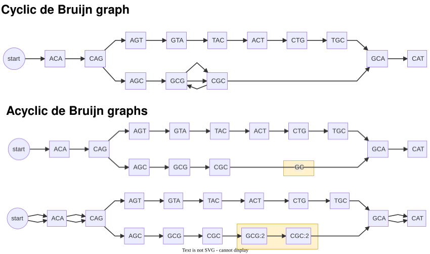

