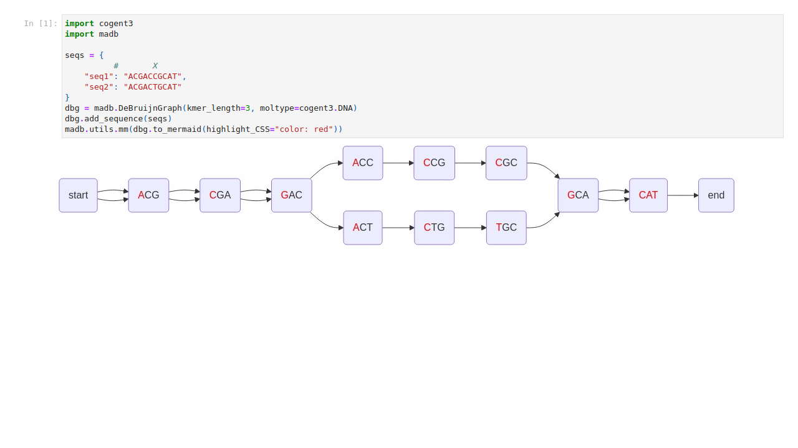
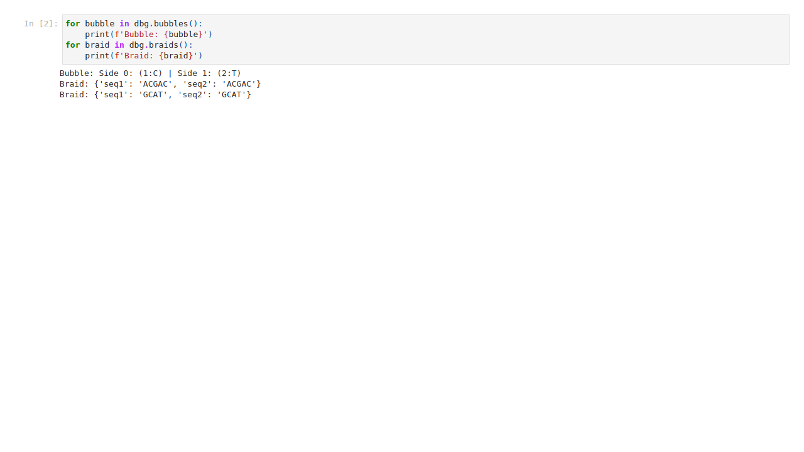
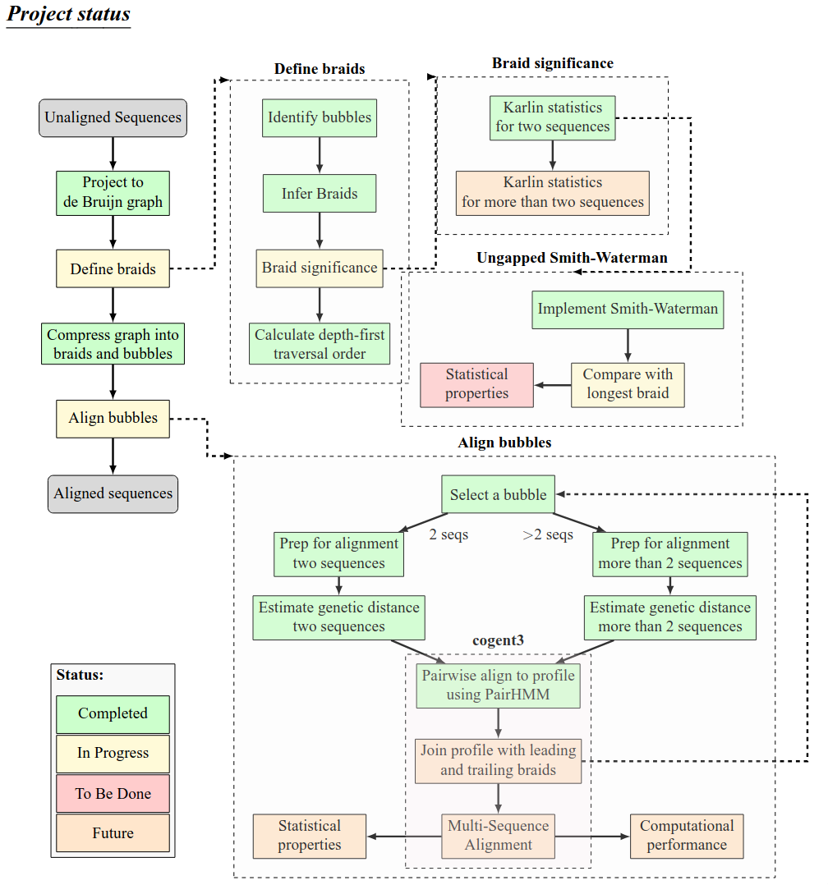
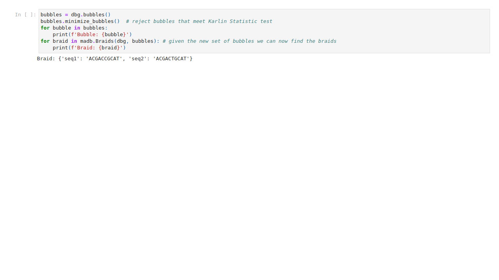

# Dividing and conquering sequence alignment using braided De Bruijn Graphs  
<!-- paginate: skip -->

- Student: First Last
- Huttley lab, Australian National University
- Supervisors: Gavin Huttley 

# REVIEW: Elements of a De Brujin graphs
<!-- paginate: true -->

# Project aims

1. Construct **de Bruijn graph** from sequences
2. Identify **bubbles** in the graph
3. Extend **braids** using _Karlin and Altschul_$_1$ statistics
4. Compare longest **braids** with ungapped _Smith-Waterman_$_2$
5. Contrast performance

<!-- _footer: "1[Karlin & Altschul, 1990  doi.org/10.1073/pnas.87.6.2264](https://doi.org/10.1073/pnas.87.6.2264)   2[Smith & Waterman, 1981  doi.org/10.1016/0022-2836(81)90087-5](10.1016/0022-2836(81)90087-5)"-->

 

# Construct de Bruijn graph from sequences

**Why**: Project multiple unaligned sequences into de Bruijn graph space
**How**: Development of a Python library with unit tests and sample data

# Identify **bubbles** and **braids** 

**Why**: Determine the regions of the graph where sequences differ
**How**: identify the beginnings of a divergence in the graph, and follow any sequence to the next node containing all the sequences that diverged

# bubble and braid identification 

## Bubbles
1. Identify each node that branches to more than one node as a **bubble start**
2. Note the set of sequences and pick any
3. Follow the sequence to find the first node with the same set of sequences as a **bubble end**
4. remove the first $kmer-1$ nodes from the bubble start
## Braids
1. Everything else is a braid

    graph LR;
        s(start);
        e(end);
        s --> ACG;
        s --> ACG;
        ACG(ACG) --> CGA(CGA);
        ACG(ACG) --> CGA(CGA);
        CGA(CGA) --> GAC(GAC);
        CGA(CGA) --> GAC(GAC);
        GAC(GAC) --> ACC(ACC);
        GAC(GAC) --> ACT(ACT);
        ACC(ACC) --> CCG(CCG);
        ACT(ACT) --> CTG(CTG);
        CCG(CCG) --> CGC(CGC);
        CTG(CTG) --> TGC(TGC);
        CGC(CGC) --> GCA(GCA);
        TGC(TGC) --> GCA(GCA);
        GCA(GCA) --> CAT(CAT);
        GCA(GCA) --> CAT(CAT);
        CAT(CAT) --> e;

# Extend **braids** using _Karlin and Altschul_$_1$ statistics

**Why**: Construct braids from non bubble segments, or segments where the bubbles have equal sides and the changes are not significant per the Karlin statistic
**How**: Use the start of any bubble with equal length sides to identify a braid end, and the end of the previous bubble that is not equal length to identify a braid start if bubbles withing the braid are equal length then apply the karlin statistic to determine if the bubble should be removed from the list of bubbles

<!-- _footer: "1[Karlin & Altschul, 1990  doi.org/10.1073/pnas.87.6.2264](https://doi.org/10.1073/pnas.87.6.2264)"-->

# compare longest **braids** with ungapped _Smith-Waterman_$_1$

**Why**: An ungapped Smith-Waterman function should return the longest local alignment in any pair of sequences, this should be the same as the longest braid in a de Bruijn graph

**Bonus**: we find all braids at the same time

<!-- _footer: "1[Smith & Waterman, 1981  doi.org/10.1016/0022-2836(81)90087-5](10.1016/0022-2836(81)90087-5)"-->

# contrast performance

**Why**: I can compare the results of the de Bruijn graph finding all local alignments with Smith-Waterman finding the optimal(longest) to see if the de Bruijn graph method is more efficient
**How**: TBD
**Result**: TBD
**Conclusion**: TBD

    
# Thanks

- Gavin Huttley

## ... and the Huttleylab

# Questions & Answers

# Citations
<!-- paginate: False -->
- [Needleman & Wunsch (1970), 'A general method applicable to the search for similarities in the amino acid sequence of two proteins'  doi.org/10.1016/0022-2836(70)90057-4, 2010](https://doi.org/10.1016/0022-2836(70)90057-4)

